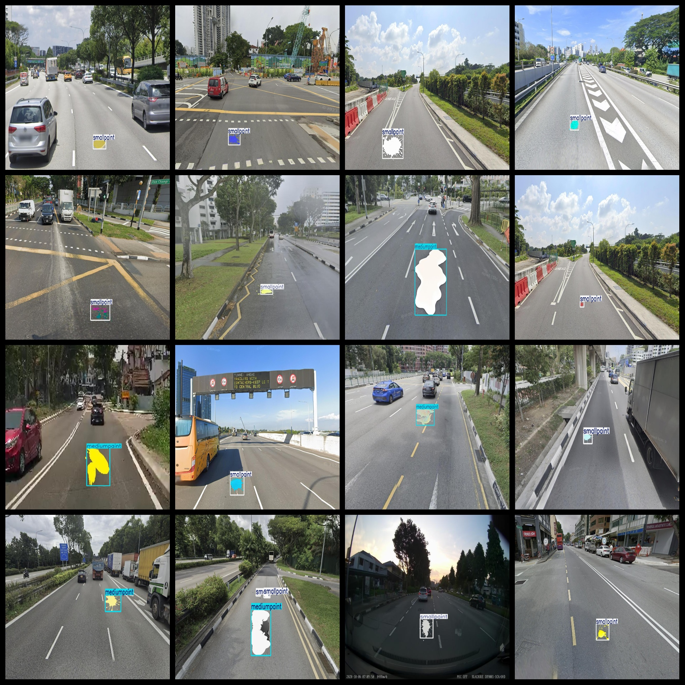

# Road Spilled Objects Detection Dataset 1650 Images VOC+YOLO Format

The Road Spilled Objects Detection Dataset consists of 1650 images in the VOC+YOLO format, organized into three folders for easy access.

The dataset is available in three main folders: JPEGImages, Annotations, and labels.

In the JPEGImages folder, there are a total of 1650 jpg images, each with their respective file names.

The Annotations folder contains 1650 xml files, detailing the annotations for each image.

Lastly, the labels folder contains 1650 txt files, which contain the labels for each image.

There are a total of 3 label categories: "bigpaint", "mediumpaint", and "smallpaint".

For each category, the number of frames (boxes) is as follows:

- "bigpaint": 81 boxes
- "mediumpaint": 399 boxes
- "smallpaint": 1365 boxes

Total boxes = 1845

The images are all at high resolution, ensuring that they are clear and detailed. Additionally, they have not been enhanced.

The repository where this dataset can be found is at: datasets_sl.

Each box is represented by a rectangle shape, designed to facilitate target detection recognition.

It should be noted that this dataset does not guarantee the accuracy or precision of any models trained on it, nor does it provide any assurances regarding the accuracy of the model weights. The dataset is intended to provide accurate and reasonable annotations.

Please note that further information about this dataset is not provided in this document.

## Images

---

Here is a pay link on Stripe (https://buy.stripe.com/3cs8yP7sY87d0vu9AB). Please contact me lonlonago@foxmail.com after funding $89, and I will send you a complete data files, thank you!

